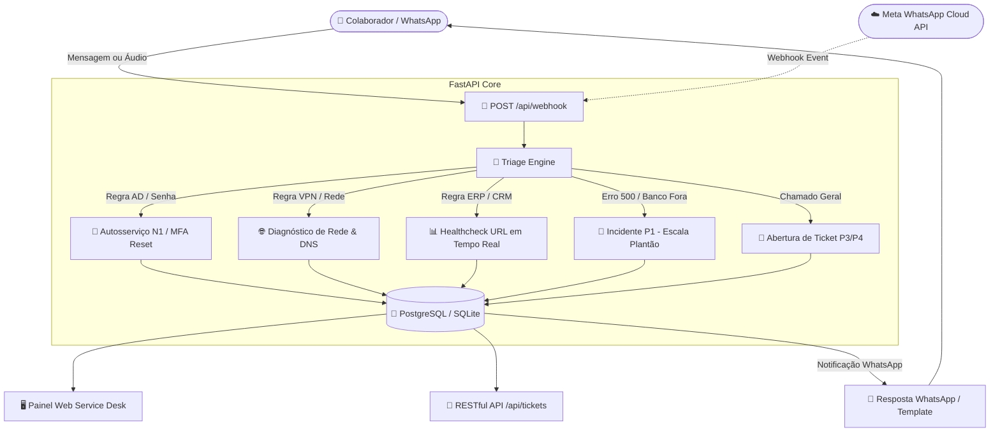

# 🤖 Service Desk WhatsApp Automation & Diagnostics Bot

<p align="center">
  
  
  
  
  
  
</p>

---

## 📖 Visão Geral

O **Service Desk WhatsApp Automation & Diagnostics Bot** é uma solução corporativa completa de **Autoatendimento N1**, **Triagem Inteligente de Chamados** e **Diagnóstico Ativo de Infraestrutura** integrada ao **WhatsApp** (Meta Cloud API & Webhook Mock).

A aplicação analisa as mensagens enviadas pelos colaboradores, identifica a categoria do incidente (**Active Directory/Senha**, **VPN/Rede**, **Incidentes Críticos P1**, **ERP/CRM**, **Hardware**), realiza checagens ativas de saúde de servidores em tempo real, executa **auto-remediação N1** sem intervenção humana e gera protocolos únicos com persistência relacional e controle de SLA.

Além da API RESTful e documentação Swagger, o projeto acompanha um **Dashboard Web integrado** com **Simulador do WhatsApp Web em tempo real** e um **CLI interativo no terminal** para testes sem necessidade de credenciais pagas da Meta.

---

## 🏛️ Arquitetura do Sistema



---

## ✨ Funcionalidades Principais

* **📡 Webhook WhatsApp Multi-formato**: Suporte completo ao fluxo oficial da **Meta Cloud API** (verificação `GET hub.challenge` e `POST messages`) e payloads diretos para simulação.
* **🧠 Motor de Triagem Inteligente (`triage_engine.py`)**:
  * **Active Directory & Senhas**: Detecção de bloqueios de conta com instruções imediatas de reset via MFA (`RESOLVED_AUTO`).
  * **Rede & VPN**: Diagnóstico de conectividade em tempo real com orientações de DNS e adaptor de rede.
  * **Incidentes Críticos P1**: Identificação de termos de alta severidade (*"banco fora"*, *"erro 500"*, *"produção parada"*), escalando imediatamente para o time N2/DevOps com protocolo de emergência.
  * **Sistemas Corporativos**: Consulta de disponibilidade em tempo real de CRM, ERP SAP, VPN Gateway e Cluster de Banco de Dados.
* **🛠️ Diagnóstico & Auto-Remediação N1 (`auto_fix.py`)**: Healthchecks assíncronos que respondem ao usuário se o sistema está operante ou em janela de manutenção antes da abertura de tickets manuais.
* **📊 Painel Web & Simulador WhatsApp Web**: Interface visual moderna Dark Mode com estatísticas SLA, gestão de chamados em tempo real e simulador de conversas interativo.
* **💻 CLI Interativo de Terminal (`scripts/simulate_whatsapp.py`)**: Menu interativo com cenários pré-configurados para testes rápidos de ponta a ponta.
* **🧪 Testes Automatizados com Pytest**: Cobertura completa de testes unitários e de integração para webhooks, motor de triagem, CRUD de tickets e diagnósticos.

---

## 📂 Estrutura do Projeto

```plaintext
servicedesk-bot/
├── app/
│   ├── core/
│   │   ├── config.py             # Configurações Pydantic Settings e .env
│   │   └── database.py           # Conexão SQLAlchemy & SessionLocal (PostgreSQL / SQLite)
│   ├── models/
│   │   ├── base.py               # DeclarativeBase e mixins de UUID e timestamps
│   │   ├── ticket.py             # Modelo Ticket (protocolo, categoria, prioridade P1-P4, status)
│   │   ├── log.py                # Modelo MessageLog (histórico de mensagens e payloads)
│   │   └── user.py               # Modelos CorporateUser e CorporateService
│   ├── schemas/
│   │   ├── webhook.py            # Schemas Pydantic para payload Meta WhatsApp & Mock
│   │   ├── ticket.py             # Schemas de criação, filtros, estatísticas e atualização
│   │   └── health.py             # Schemas de monitoramento de serviços de infraestrutura
│   ├── services/
│   │   ├── whatsapp.py           # Envio, recepção e templates corporativos formatados
│   │   ├── triage_engine.py      # Motor de triagem inteligente e cálculo de SLA
│   │   └── auto_fix.py           # Diagnósticos em tempo real e auto-remediação N1
│   ├── routers/
│   │   ├── webhook.py            # Endpoints GET e POST /api/webhook
│   │   ├── tickets.py            # CRUD RESTful e atualização de status com notificação
│   │   ├── health.py             # Healthcheck e diagnóstico sob demanda
│   │   └── dashboard.py          # Métricas analíticas e estatísticas em tempo real
│   ├── static/
│   │   ├── style.css             # Estilos modernos Dark Mode com Glassmorphism
│   │   └── app.js                # Lógica frontend do Dashboard e Simulador WhatsApp
│   ├── templates/
│   │   └── index.html            # Interface Web integrada
│   └── main.py                   # Ponto de entrada FastAPI com Swagger OpenAPI
├── scripts/
│   ├── simulate_whatsapp.py      # CLI interativo para testes no terminal
│   └── seed_data.py              # Script para popular tickets e serviços de demonstração
├── tests/
│   ├── conftest.py               # Fixtures Pytest com SQLite isolado em memória
│   ├── test_webhook.py           # Testes de recepção e validação do webhook
│   ├── test_triage.py            # Testes do motor de classificação e priorização P1-P4
│   ├── test_tickets.py           # Testes de CRUD e atualização de status
│   └── test_health.py            # Testes de endpoints de diagnóstico e saúde
├── Dockerfile                    # Containerização para produção
├── docker-compose.yml            # Orquestração FastAPI + PostgreSQL 16
├── requirements.txt              # Dependências do projeto
├── pytest.ini                    # Configuração de execução dos testes
├── .env.example                  # Template de variáveis de ambiente
└── README.md                     # Documentação completa do repositório
```

---

## 🚀 Como Executar o Projeto

### 1. Pré-requisitos
* **Python 3.12+** instalado
* **Docker & Docker Compose** (opcional, para rodar com PostgreSQL)

### 2. Clonando o Repositório e Configurando o Ambiente
```bash
# Clone o repositório
git clone https://github.com/SEU_USUARIO/servicedesk-bot.git
cd servicedesk-bot

# Crie e ative um ambiente virtual
python -m venv venv
# No Windows:
venv\Scripts\activate
# No Linux/Mac:
source venv/bin/activate

# Instale as dependências
pip install -r requirements.txt

# Configure as variáveis de ambiente
cp .env.example .env
```

---

### 3. Executando Localmente (com SQLite out-of-the-box)

```bash
# Opcional: Popule dados de demonstração
python scripts/seed_data.py

# Inicie o servidor FastAPI com live-reload
uvicorn app.main:app --reload --host 0.0.0.0 --port 8000
```

* 🖥️ **Painel Web & Simulador WhatsApp**: Abra [http://localhost:8000/](http://localhost:8000/) no navegador.
* 📚 **Documentação Interativa Swagger**: Acesse [http://localhost:8000/docs](http://localhost:8000/docs).

---

### 4. Executando com Docker Compose (FastAPI + PostgreSQL 16)

```bash
# Subir aplicação e banco PostgreSQL
docker compose up --build -d

# Visualizar logs
docker compose logs -f api
```

---

## 🧪 Testes Automatizados

Para rodar toda a suíte de testes com **Pytest**:

```bash
pytest tests/ -v
```

Saída esperada:
```plaintext
collected 15 items

tests/test_health.py::test_api_basic_health PASSED                       [  6%]
tests/test_health.py::test_monitored_services_health PASSED              [ 13%]
tests/test_health.py::test_run_on_demand_diagnostic PASSED               [ 20%]
tests/test_tickets.py::test_create_and_list_tickets PASSED               [ 26%]
tests/test_tickets.py::test_update_ticket_status PASSED                  [ 33%]
tests/test_triage.py::test_classify_critical_database_incident PASSED    [ 40%]
tests/test_triage.py::test_classify_auth_password_reset PASSED           [ 46%]
tests/test_triage.py::test_classify_vpn_network PASSED                   [ 53%]
tests/test_triage.py::test_classify_crm_service PASSED                   [ 60%]
tests/test_triage.py::test_classify_hardware_issue PASSED                [ 66%]
tests/test_triage.py::test_classify_general_fallback PASSED              [ 73%]
tests/test_webhook.py::test_webhook_get_verification_success PASSED      [ 80%]
tests/test_webhook.py::test_webhook_get_verification_invalid_token PASSED [ 86%]
tests/test_webhook.py::test_webhook_post_direct_mock PASSED              [ 93%]
tests/test_webhook.py::test_webhook_post_meta_cloud_api_format PASSED    [100%]

======================= 15 passed in 0.93s =======================
```

---

## 📱 Simulador CLI no Terminal

Você pode simular conversas do WhatsApp diretamente no terminal sem custos:

```bash
python scripts/simulate_whatsapp.py
```

Menu interativo:
```plaintext
====================================================================
 🤖 SERVICE DESK WHATSAPP BOT - SIMULADOR INTERATIVO CLI
====================================================================
 Escolha um cenário para simular:
 [1] 🔐 Esqueci minha senha do AD / Usuário bloqueado (Autoatendimento N1)
 [2] 🌐 Não consigo conectar na VPN da empresa (Diagnóstico de Rede N1)
 [3] 🚨 Erro 500 no Banco de Dados / Produção parada! (Incidente Crítico P1)
 [4] 📊 O CRM corporativo está fora do ar? (Diagnóstico de Serviço em Tempo Real)
 [5] 🖥️ Meu segundo monitor não dá sinal de vídeo (Chamado Geral de Hardware)
 [6] ✍️ Digitar mensagem personalizada livre
 [7] 📋 Consultar últimos tickets abertos no banco
 [8] 🩺 Executar diagnóstico geral de servidores corporativos
 [0] 🚪 Sair
```

---

## 📡 Endpoints da API RESTful

| Método | Endpoint | Descrição |
|---|---|---|
| `GET` | `/api/webhook` | Verificação do token de webhook padrão da Meta (`hub.challenge`). |
| `POST` | `/api/webhook` | Recepção de mensagens do WhatsApp e processamento no Motor de Triagem. |
| `GET` | `/api/tickets` | Listagem de chamados com filtros (status, prioridade, categoria, busca). |
| `GET` | `/api/tickets/{id}` | Detalhes do chamado e histórico completo de mensagens e logs. |
| `POST` | `/api/tickets` | Abertura manual de chamado interno. |
| `PATCH` | `/api/tickets/{id}/status` | Atualização de status com disparo de notificação ao WhatsApp. |
| `DELETE` | `/api/tickets/{id}` | Exclusão de chamado. |
| `GET` | `/api/health` | Healthcheck básico da API. |
| `GET` | `/api/health/services` | Status em tempo real de todos os sistemas corporativos monitorados. |
| `POST` | `/api/health/diagnostics` | Diagnóstico ativo sob demanda para um serviço específico. |
| `GET` | `/api/dashboard/stats` | Métricas de SLA, taxa de auto-resolução N1 e gráficos. |

---

## 🌐 Deploy em Produção

### 🔺 Opção 1: Deploy na Vercel (Recomendado para Preview & Serverless)
O projeto já está configurado com `vercel.json` e o entrypoint serverless `api/index.py`:

1. **Via Vercel CLI**:
   ```bash
   npm i -g vercel
   vercel
   ```
2. **Via Painel Web da Vercel (GitHub Integration)**:
   * Importe seu repositório no dashboard da [Vercel](https://vercel.com).
   * O framework será detectado automaticamente como **Other** (com base no `vercel.json`).
   * (Opcional) Adicione variáveis de ambiente como `WHATSAPP_VERIFY_TOKEN` e `DATABASE_URL` (PostgreSQL / Supabase / Neon). Caso não adicione, o preview utilizará automaticamente o SQLite em `/tmp` com dados de demonstração populados.

---

### 🚀 Opção 2: Deploy no Render / Railway / Fly.io
1. Conecte este repositório no [Render](https://render.com) ou [Railway](https://railway.app).
2. Adicione as variáveis de ambiente baseadas no `.env.example`.
3. Configure o **Start Command**:
   ```bash
   uvicorn app.main:app --host 0.0.0.0 --port $PORT
   ```
4. Configure a URL do webhook no painel do **Meta for Developers**:
   * **Callback URL**: `https://seu-app.vercel.app/api/webhook` (ou do Render/Railway)
   * **Verify Token**: O mesmo valor definido em `WHATSAPP_VERIFY_TOKEN`.

---

## 📄 Licença

Distribuído sob a licença **MIT**. Consulte `LICENSE` para mais informações.
